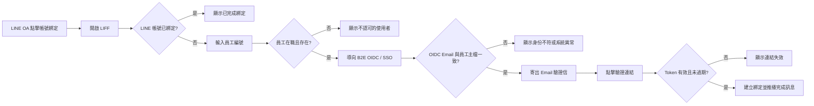

# 全聯員工 LINE 帳號綁定開發規格書

| 文件資訊 | 內容 |
| --- | --- |
| 版本 | v1.0 |
| 功能 | LINE 使用者與企業員工帳號綁定 |
| 前端入口 | LINE 官方帳號 Rich Menu → LIFF 綁定頁 |
| 依據文件 | `LINE_LIFF_綁定帳號_網頁原型.html`、`技術處辦公室自動化_LINE_AI機器人_系統架構與API規格_Outline.md` |
| 技術方向 | LINE LIFF／LINE Messaging API／B2E OIDC（Authorization Code + PKCE）／.NET 8／PostgreSQL |

## 1. 目的與範圍

讓全聯員工將 LINE 帳號與企業員工身份安全綁定。綁定成功後，系統可依員工身份進行 LINE 通知與分眾推播。

本規格涵蓋：

- LIFF 頁面取得 LINE User ID。
- 員工編號驗證。
- 企業 B2E OIDC 身份驗證。
- Email 驗證信確認。
- 建立、查詢及解除 LINE 綁定。

本頁原型中的情境控制台、模擬資料與「模擬點擊驗證連結」僅供畫面展示，正式版不得保留。

## 2. 使用流程



### 2.1 流程規則

1. LIFF 啟動後由 LINE LIFF SDK 取得 `line_user_id`，後端不得信任前端自行輸入的 User ID。
2. 後端先查詢綁定紀錄；已綁定時直接顯示完成，不重複寫入。
3. 員工編號需存在於 `USR_Member`，且員工狀態為在職有效。
4. OIDC 流程使用 `state` 與 PKCE；`state`、`code_verifier` 僅短暫保存於後端工作階段。
5. OIDC 回傳 Email 必須與員工主檔帳號一致，通過後才寄送驗證信。
6. Email 驗證 Token 有效期限為 30 分鐘；Token 僅能使用一次。
7. 驗證成功後寫入 `public.sys_line_bindings`，並推播綁定完成訊息。

## 3. 畫面規格

### 3.1 畫面一：LIFF 載入與已綁定

**位置**：LINE App 內的 LIFF 頁面。

| 項目 | 說明 |
| --- | --- |
| 載入狀態 | 顯示「正在透過 LIFF 取得您的 LINE 身份資訊…」與載入動畫 |
| 已綁定狀態 | 顯示「您已完成綁定」及「無需重複操作」 |
| 操作 | 已綁定時不顯示員工編號輸入欄位，可關閉頁面 |

**畫面說明**：上方為 LINE 官方帳號標題，下方顯示流程進度「開啟頁面／輸入員編／身份驗證／Email 驗證／完成」。

### 3.2 畫面二：輸入員工編號

**位置**：LINE App 內的 LIFF 頁面。

| 欄位／元件 | 型態 | 規則 |
| --- | --- | --- |
| 員工編號 | text input | 必填；前後空白需清除 |
| 開始驗證 | button | 按下後顯示驗證中，不可重複送出 |
| 說明文字 | fixed text | 說明系統將透過企業 OIDC 驗證身份 |

**畫面說明**：以單欄表單呈現，主按鈕使用 LINE 綠色。送出後依序顯示「正在核對員工資料」及「轉跳企業單一登入驗證中」。

### 3.3 畫面三：Email 驗證信已寄出

**位置**：LIFF 頁面；Email 連結另開瀏覽器驗證頁。

| 元件 | 說明 |
| --- | --- |
| 收件 Email | 僅顯示遮罩後 Email，例如 `ch***o@pxmart.com.tw` |
| 狀態 | 顯示「等待驗證中」；成功點擊後更新為已開啟驗證頁面 |
| 倒數 | 顯示 Token 剩餘有效時間，最長 30 分鐘 |
| 重新發送 | 可重新寄送驗證信；需有頻率限制 |

**畫面說明**：左側維持 LIFF 等待狀態，右側瀏覽器頁面顯示驗證結果。正式版不得在畫面中顯示完整 Token。

### 3.4 畫面四：Email 驗證結果與完成

**驗證成功**：

- 瀏覽器頁顯示「帳號綁定驗證成功」。
- 提示返回 LINE 官方帳號查看結果。
- LIFF 頁面顯示「綁定完成！」。
- LINE OA 推播：「綁定完成！歡迎使用全聯智能服務……」。

**驗證失敗**：

- Token 無效或逾期：顯示「驗證連結無效或已過期」，提示返回 LINE 重新申請。
- 員工不存在：顯示錯誤代碼 `EMP_NOT_FOUND`。
- OIDC 查無 Email：顯示錯誤代碼 `OIDC_EMAIL_NOT_FOUND`。
- OIDC Email 不一致：顯示錯誤代碼 `IDENTITY_MISMATCH`。

錯誤訊息需避免揭露過多員工主檔資訊，並提供可供稽核的 correlation ID。

## 4. API 規格

### 4.1 API 清單

| Method | Path | 說明 |
| --- | --- | --- |
| GET | `/binding/start?line_user_id={id}` | 建立 OIDC 工作階段並導向企業 SSO；正式版建議由後端從 LIFF 驗證結果取得 User ID |
| GET | `/binding/status/{line_user_id}` | 查詢目前綁定狀態 |
| GET | `/binding/callback` | 接收 OIDC callback，交換 token 並完成身份核對 |
| GET | `/binding/verify?token={token}` | 驗證 Email Token 並完成綁定 |
| POST | `/binding/resend` | 重新寄送驗證信 |
| POST | `/binding/unbind` | 解除綁定 |
| POST | `/internal/binding/sync` | 排程核對員工在職狀態並停用失效綁定 |

### 4.2 主要回應範例

`GET /binding/status/{line_user_id}`：

```json
{
  "line_user_id": "U1234...",
  "bound": true,
  "employee_id": "E00123",
  "dept_code": "TECH-PROD",
  "role": "PM",
  "segments": ["全體技術處", "商品中台組"],
  "bound_at": "2026-07-01T09:00:00+08:00"
}
```

錯誤回應格式：

```json
{
  "code": "IDENTITY_MISMATCH",
  "message": "登入身份與員工編號不符",
  "correlation_id": "8f2c..."
}
```

## 5. 資料與安全要求

### 5.1 綁定資料

`sys_line_bindings` 至少保存：

- `line_user_id`：唯一索引，不可重複綁定不同員工。
- `employee_id`：員工編號。
- `dept_code`、`role`：必要的分眾資訊。
- `status`：`active`／`inactive`。
- `bound_at`、`unbound_at`、`updated_at`。

`oidc_sessions` 保存短效 `state`、PKCE 資訊與必要關聯資料，設定 TTL，到期自動刪除；OIDC Token 不得以明碼長期落地。

### 5.2 安全與治理

- 全程使用 HTTPS；驗證 `state`、PKCE、OIDC issuer、nonce 與 token 簽章。
- Email Token 使用不可預測的隨機值，資料庫只保存雜湊值，驗證後立即失效。
- `line_user_id`、員工編號與 Email 僅供必要服務使用，畫面顯示 Email 時遮罩。
- 綁定、解除綁定、同步停用、驗證失敗皆寫入 `audit_logs`。
- 員工每日同步；離職或無效員工的綁定停用，並移除相關分眾標籤。
- 員工不存在、Email 不存在與身份不一致的錯誤需限流，避免帳號枚舉。

## 6. 驗收條件

- 未綁定 LINE 帳號可完成：員編輸入 → OIDC → Email 驗證 → 建立綁定。
- 已綁定 LINE 帳號重新開啟時，顯示已完成綁定且不重複建檔。
- 不存在或非在職員工無法繼續流程，回傳 `EMP_NOT_FOUND`。
- OIDC Email 缺漏或不一致時不寄出驗證信，也不建立綁定。
- 超過 30 分鐘或已使用的 Token 無法完成綁定。
- 綁定成功後可查到 `line_user_id ↔ employee_id`，且 LINE OA 收到完成訊息。
- 所有成功、失敗、解除與同步事件均有稽核紀錄。
- 重新整理或重複點擊不會造成重複綁定或重複寄信。

## 7. 待確認事項

- B2E OIDC Provider 的正式 issuer、client ID、redirect URI 與 claims 名稱。
- `USR_Member.Username` 是否固定為 Email，以及員工主檔 API 的正式介面。
- LINE LIFF ID、LINE OA Channel ID 與正式 Rich Menu 動作設定。
- Email 寄送服務、寄件者、模板與重新寄送頻率限制。
- 綁定解除權限：使用者自行解除、管理者解除，或兩者皆可。
- Token 有效期限目前依原型採 30 分鐘，正式值由資安與需求單位確認。
