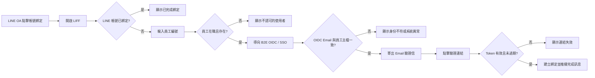

# 全聯員工 LINE 帳號綁定開發規格書

| 文件資訊 | 內容 |
| --- | --- |
| 版本 | v1.0 |
| 功能 | LINE 使用者與企業員工帳號綁定 |
| 前端入口 | LINE 官方帳號 Rich Menu → LIFF 綁定頁 |
| 依據文件 | `LINE_LIFF_綁定帳號_網頁原型.html`、`技術處辦公室自動化_LINE_AI機器人_系統架構與API規格_Outline.md` |
| 技術方向 | LINE LIFF／LINE Messaging API／B2E OIDC（Authorization Code + PKCE）／.NET 8／PostgreSQL |

## 1. 目的與範圍

讓全聯員工將 LINE 帳號與企業員工身份安全綁定。綁定成功後，系統可依員工身份進行 LINE 通知與分眾推播。

本規格涵蓋：LIFF 取得 LINE User ID、員工編號驗證、B2E OIDC 身份驗證、Email 驗證信，以及建立、查詢與解除 LINE 綁定。

原型中的情境控制台、模擬資料與「模擬點擊驗證連結」僅供畫面展示，正式版不得保留。

## 2. 使用流程



### 2.1 流程規則

1. LIFF 啟動後由 LINE LIFF SDK 取得 `line_user_id`，後端不得信任前端自行輸入的 User ID。
2. 後端先查詢綁定紀錄；已綁定時直接顯示完成，不重複寫入。
3. 員工編號需存在於 `USR_Member`，且員工狀態為在職有效。
4. OIDC 使用 `state` 與 PKCE；相關資料僅短暫保存於後端工作階段。
5. OIDC 回傳 Email 必須與員工主檔帳號一致，通過後才寄送驗證信。
6. Email 驗證 Token 有效期限為 30 分鐘，且只能使用一次。
7. 驗證成功後寫入 `public.sys_line_bindings`，並推播綁定完成訊息。

## 3. 畫面規格

### 3.1 LIFF 載入與已綁定

**位置**：LINE App 內的 LIFF 頁面。

- 載入時顯示「正在透過 LIFF 取得您的 LINE 身份資訊…」與載入動畫。
- 已綁定時顯示「您已完成綁定」及「無需重複操作」，不再顯示員工編號輸入欄位。
- 頁面上方顯示 LINE 官方帳號標題與流程進度：開啟頁面／輸入員編／身份驗證／Email 驗證／完成。

### 3.2 輸入員工編號

| 欄位／元件 | 型態 | 規則 |
| --- | --- | --- |
| 員工編號 | text input | 必填；送出前清除前後空白 |
| 開始驗證 | button | 送出後顯示驗證中，不可重複送出 |
| 說明文字 | fixed text | 說明將透過企業 OIDC 驗證身份 |

**畫面說明**：單欄表單，主按鈕使用 LINE 綠色；送出後顯示「正在核對員工資料」及「轉跳企業單一登入驗證中」。

### 3.3 Email 驗證信已寄出

- 顯示遮罩後的收件 Email，例如 `ch***o@pxmart.com.tw`。
- 顯示「等待驗證中」與 Token 剩餘時間，最長 30 分鐘。
- 提供「重新發送驗證信」，正式版需加上頻率限制。
- Email 連結另開瀏覽器驗證頁；正式版不顯示完整 Token。

### 3.4 驗證結果與完成

**成功**：瀏覽器顯示「帳號綁定驗證成功」；LIFF 顯示「綁定完成！」；LINE OA 推播完成訊息。

**失敗**：

- Token 無效或逾期：顯示「驗證連結無效或已過期」。
- 員工不存在：`EMP_NOT_FOUND`。
- OIDC 查無 Email：`OIDC_EMAIL_NOT_FOUND`。
- OIDC Email 不一致：`IDENTITY_MISMATCH`。

錯誤訊息不得揭露過多員工主檔資訊，並提供 correlation ID 供稽核追蹤。

## 4. API 規格

| Method | Path | 說明 |
| --- | --- | --- |
| GET | `/binding/start?line_user_id={id}` | 建立 OIDC 工作階段並導向企業 SSO |
| GET | `/binding/status/{line_user_id}` | 查詢綁定狀態 |
| GET | `/binding/callback` | 接收 OIDC callback，交換 token 並核對身份 |
| GET | `/binding/verify?token={token}` | 驗證 Email Token 並完成綁定 |
| POST | `/binding/resend` | 重新寄送驗證信 |
| POST | `/binding/unbind` | 解除綁定 |
| POST | `/internal/binding/sync` | 排程核對在職狀態並停用失效綁定 |

`GET /binding/status/{line_user_id}` 回應範例：

```json
{
  "line_user_id": "U1234...",
  "bound": true,
  "employee_id": "E00123",
  "dept_code": "TECH-PROD",
  "role": "PM",
  "segments": ["全體技術處", "商品中台組"],
  "bound_at": "2026-07-01T09:00:00+08:00"
}
```

## 5. 資料與安全要求

`sys_line_bindings` 至少保存 `line_user_id`、`employee_id`、`dept_code`、`role`、`status`、`bound_at`、`unbound_at`、`updated_at`，其中 `line_user_id` 應建立唯一索引。

`oidc_sessions` 僅短效保存 `state`、PKCE 資訊與必要關聯資料；OIDC Token 不得以明碼長期落地。Email Token 應使用不可預測的隨機值，資料庫只保存雜湊值，驗證後立即失效。

全程使用 HTTPS，驗證 state、PKCE、issuer、nonce 與 token 簽章。畫面上的 Email 必須遮罩。綁定、解除、同步停用與驗證失敗均寫入 `audit_logs`。每日同步員工在職狀態，離職或無效員工的綁定需停用並移除分眾標籤。

## 6. 驗收條件

- 未綁定帳號可完成員編 → OIDC → Email → 建立綁定。
- 已綁定帳號重開頁面時不重複建檔。
- 不存在或非在職員工回傳 `EMP_NOT_FOUND`。
- OIDC Email 缺漏或不一致時不寄信、不建綁定。
- 逾期或已使用 Token 無法完成綁定。
- 綁定成功後可查到 `line_user_id ↔ employee_id`，並收到 LINE 完成訊息。
- 重整或重複點擊不會造成重複綁定或重複寄信。
- 所有成功、失敗、解除與同步事件均有稽核紀錄。

## 7. 待確認事項

- OIDC issuer、client ID、redirect URI 與 claims 名稱。
- `USR_Member.Username` 是否固定為 Email，以及員工主檔 API 介面。
- LIFF ID、LINE OA Channel ID 與 Rich Menu 動作設定。
- Email 寄送服務、模板與重新寄送頻率限制。
- 綁定解除權限與 Token 正式有效期限。
