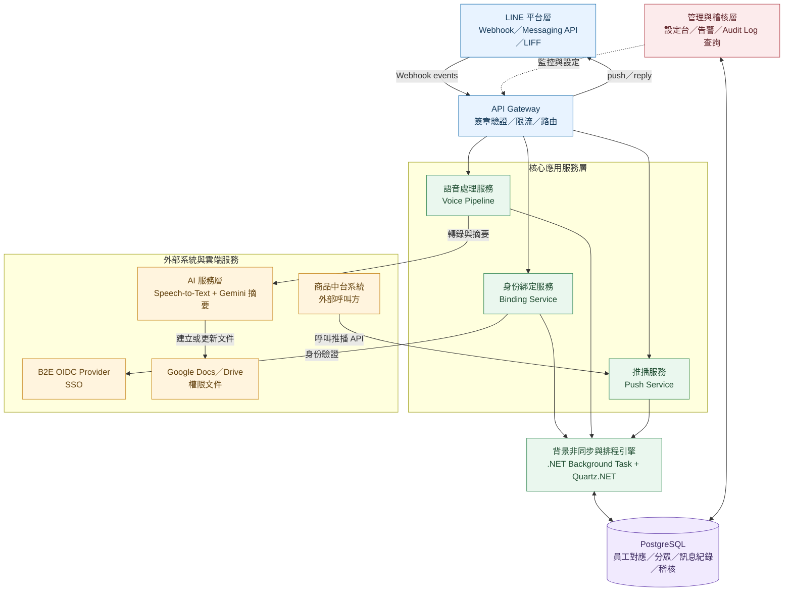

# 技術處辦公室自動化 LINE AI 機器人

## 系統架構設計文件 ＋ API 規格書

| 文件資訊 | 內容 |
| --- | --- |
| 版本 | v0.1（需求盤點前草案） |
| 對應提案 | 《技術處辦公室自動化_LINE_AI機器人提案20260722》 |
| 技術棧 | .NET C#／.NET 8（ASP.NET Core）／PostgreSQL／Quartz.NET（排程）／LINE Messaging API／Google Cloud（Speech-to-Text、Vertex AI Gemini、Google Docs API） |

### 文件導覽

1. [系統總覽](#1-系統總覽)
2. [整體分層架構](#2-整體分層架構)
3. [功能一：帳號綁定](#3-功能一line-使用者與-b2e-oidc-帳號綁定)
4. [功能二：語音摘要](#4-功能二語音訊息分析摘要機器人小露露)
5. [功能三：作業推播](#5-功能三商品中台系統作業推播全發分眾指定人員)
6. [資料庫設計](#6-資料庫設計postgresql)
7. [安全與治理設計](#7-安全與治理設計)
8. [部署架構建議](#8-部署架構建議)
9. [里程碑對應](#9-里程碑對應12-週-mvp延續提案時程並納入-f3)
10. [驗收指標](#10-驗收指標)

---

## 1. 系統總覽

依提案書，本系統將 LINE 從溝通工具升級為「工作資訊入口」，本次設計涵蓋三項功能：

| 編號 | 功能 | 對應提案能力 |
|---|---|---|
| F1 | LINE 使用者與 B2E OIDC 帳號綁定 | 能力一：員工身份綁定 |
| F2 | 語音訊息分析摘要機器人「小露露」 | 能力三：語音轉文字與摘要 |
| F3 | 商品中台系統作業推播（全發／分眾／指定人員） | 能力一延伸推播、群聊 Daily 彙整之推播基礎 |

設計原則沿用提案治理原則：**身份、內容、文件、稽核分離管理**；AI 僅協助整理、不取代負責人確認；不在 LINE 儲存敏感員工主檔資料。

---

## 2. 整體分層架構



> 圖例：實線代表主要資料或服務呼叫；虛線代表管理、監控與設定關係。

### 2.1 .NET 8 專案結構

- **Endpoints（路由控制層）**：負責接收外部 HTTP 請求，包含 `AuthEndpoint`（LINE ↔ OIDC 綁定流程）、`LineWebhookEndpoint`（接收並分派 LINE 事件），以及對外開放給商品中台等系統呼叫的 `PushApiEndpoint`（推播 API）。
- **Services（核心業務邏輯層）**：透過相依性注入（DI）共用邏輯，包含 `VoicePipeline`（語音下載、AI 轉錄摘要與 Google Doc 寫入）、`LineMessagingService`（LINE SDK 封裝）、`AuthService`（登入驗證）。
- **Jobs（背景排程模組）**：透過 Quartz.NET 引擎集中管理，例如 `DailyReportJob` 負責群聊每日 18:00 的彙整任務。
- **Data & Models（資料與模型層）**：包含 EF Core `DbContext` 實體層，負責與 PostgreSQL 溝通，處理員工對應、分眾管理與 Audit Log 自動稽核寫入。
- **Admin & Shared（共用與管理層）**：包含共用加解密工具、全域例外處理（Middleware）、系統環境設定檔（appsettings），以及未來的管理後台 API 介面。

---

## 3. 功能一：LINE 使用者與 B2E OIDC 帳號綁定

### 3.1 綁定流程

```
1. 使用者於 LINE OA 選單點擊「帳號綁定」
   → LIFF 頁面帶出 line_user_id

2. 後端產生 state + PKCE code_verifier，寫入 oidc_sessions（短效）
   → 302 導向企業 B2E OIDC Provider /authorize

3. 使用者於企業 SSO／OTP 完成驗證

4. OIDC Provider callback 帶 code + state 回後端
   → 後端以 code 換 token（Authorization Code + PKCE）
   → 解析 id_token 取得 employee_id、dept_code、role claims

5. 後端呼叫「員工主檔 API」核對在職狀態、單位、角色
   → 寫入 / 更新 line_bindings、employee_segments

6. 回覆 LINE 訊息：綁定成功，並套用分眾標籤
```

### 3.2 治理設計對應

- **可解除**：提供 `POST /binding/unbind`，使用者或管理者皆可觸發。
- **定期同步**：排程 Job（每日）呼叫員工主檔 API，核對在職狀態；離職／調職者自動失效綁定並移除分眾標籤。
- **資料最小化**：DB 僅存 `line_user_id ↔ employee_id` 對應與必要分眾欄位，不存薪資、聯絡方式等敏感主檔內容；OIDC token 不落地明碼，僅暫存於 `oidc_sessions`（短效、加密、TTL 到期即刪）。
- **稽核**：綁定、解除、同步異動皆寫入 `audit_logs`。

### 3.3 API 規格

| Method | Path | 說明 | 呼叫方 |
|---|---|---|---|
| GET | `/binding/start?line_user_id=` | 產生 state，302 導向 OIDC authorize | LIFF 前端 |
| GET | `/binding/callback` | OIDC callback，完成 token 交換與建檔 | OIDC Provider |
| POST | `/binding/unbind` | 解除綁定 `{ line_user_id }` | LIFF / 管理後台 |
| GET | `/binding/status/{line_user_id}` | 查詢綁定狀態與分眾 | 內部服務 |
| POST | `/internal/binding/sync` | 排程觸發，全量核對在職狀態 | Cron |

`GET /binding/status/{line_user_id}` 回應範例：

```json
{
  "line_user_id": "U1234...",
  "bound": true,
  "employee_id": "E00123",
  "dept_code": "TECH-PROD",
  "role": "PM",
  "segments": ["全體技術處", "商品中台組"],
  "bound_at": "2026-07-01T09:00:00+08:00"
}
```

---

## 4. 功能二：語音訊息分析摘要機器人「小露露」

### 4.1 處理流程（非同步）

```
1. LINE Webhook 收到 audio 事件 → 寫入 voice_messages（狀態：received）→ 丟入 Queue
2. Worker：下載語音（加密暫存，設定 TTL 自動清除）
3. Worker：呼叫 STT（Google Cloud Speech-to-Text），輸出含時間戳記逐字稿
4. Worker：呼叫 Gemini，結構化摘要（今日進度／待追蹤事項／需確認）
   - 呼叫前先執行「敏感資訊遮罩」（如身分證字號、電話等 pattern mask）
5. Worker：將逐字稿＋摘要寫入 Google Doc（依群組權限建立文件）
6. Worker：LINE reply/push 回傳 Google Doc URL 至原群組
7. Worker：寫入 summaries，供 Daily 彙整模組合併使用
8. 排程清除暫存語音檔（依保存政策，例如 24 小時）
```

### 4.2 Gemini 結構化輸出格式（範例）

```json
{
  "today_progress": ["商品標籤母表欄位已進入確認"],
  "todo_items": [
    {"item": "NN 特流程對焦", "owner": "Winnie", "due": "待確認"},
    {"item": "QE 回歸測試", "owner": "QE", "due": "明日下午"}
  ],
  "need_confirmation": ["母表欄位確認是否代表正式定版？"],
  "confidence_flag": "medium"
}
```

### 4.3 Daily 群聊彙整（延伸）

每日排程將當日文字訊息 + 語音摘要依主題合併，產出「Daily 彙整」寫入 Google Doc，並可觸發 F3 推播通知負責人。

### 4.4 API 規格

| Method | Path | 說明 |
|---|---|---|
| （webhook）POST | `/webhook/line` | LINE 平台統一入口，內部依 event type 分派 |
| POST | `/internal/voice/process` | Worker 內部觸發（一般由 Queue 消費，非直接對外開放） |
| GET | `/voice-messages/{id}` | 查詢單筆語音處理狀態／逐字稿／摘要連結 |
| POST | `/internal/daily/generate` | 排程觸發，產出指定群組當日彙整 |
| GET | `/daily-reports/{group_id}/{date}` | 查詢 Daily 彙整內容與 Google Doc URL |

`GET /voice-messages/{id}` 回應範例：
```json
{
  "id": "vm_8891",
  "group_id": "grp_tech01",
  "status": "completed",
  "transcript_available": true,
  "summary": { "today_progress": ["..."], "todo_items": ["..."] },
  "google_doc_url": "https\://docs.google.com/document/d/xxx",
  "temp_audio_deleted": true
}
```

---

## 5. 功能三：商品中台系統作業推播（全發／分眾／指定人員）

此為對外開放的系統對系統（system-to-system）API，供商品中台等內部系統呼叫，觸發技術處 LINE@ 推播。

### 5.1 設計重點

- **對象型態**：`all`（全體技術處）／`segment`（依分眾標籤，如「商品中台組」）／`users`（指定 employee_id 或 line_user_id 清單）。
- **身份驗證**：系統對系統採 API Key + HMAC 簽章（timestamp + body 簽章防重放），不得使用個人帳密。
- **限流與防呆**：單一來源系統設定每分鐘／每日推播上限，避免誤發全體轟炸；`all` 與大型 `segment` 建議需二次確認旗標 `confirm: true`。
- **紀錄留存**：每筆推播、每個收件人送達結果皆寫入 `push_logs`，供稽核與成效追蹤。
- **失敗重試**：透過 Queue 進行退避重試（如 LINE API 暫時性錯誤），超過重試上限標記失敗並告警。

### 5.2 API 規格

**POST `/api/v1/push/broadcast`**

Headers：
```
X-Api-Key: {商品中台系統的 API Key}
X-Timestamp: 1732600000
X-Signature: HMAC-SHA256(apiSecret, timestamp + body)
```

Body：
```json
{
  "source_system": "product-middle-platform",
  "title": "上版提醒",
  "content": "商品標籤母表 v2.3 將於今日 22:00 上版，請於 21:30 前完成確認。",
  "target": {
    "type": "segment",
    "segment_ids": ["seg_product_platform_group"]
  },
  "link_url": "https\://internal.example.com/release/1234",
  "priority": "normal",
  "confirm": false
}
```

Response（202 Accepted，非同步發送）：
```json
{
  "broadcast_id": "bc_20260731_0001",
  "accepted_target_count": 42,
  "status": "queued"
}
```

**GET `/api/v1/push/{broadcast_id}/status`**
```json
{
  "broadcast_id": "bc_20260731_0001",
  "status": "completed",
  "sent": 41,
  "failed": 1,
  "failed_detail": [{ "line_user_id": "U999...", "reason": "user_blocked" }]
}
```

**GET `/api/v1/segments`**（供中台系統查詢可用分眾清單，避免亂填）
```json
[
  { "segment_id": "seg_all_tech", "name": "全體技術處", "member_count": 120 },
  { "segment_id": "seg_product_platform_group", "name": "商品中台組", "member_count": 18 },
  { "segment_id": "seg_project_members", "name": "專案成員", "member_count": 9 }
]
```

### 5.3 管理後台 API（內部使用）

| Method | Path | 說明 |
|---|---|---|
| GET | `/admin/broadcasts` | 查詢歷史推播與送達統計 |
| POST | `/admin/segments` | 建立／調整分眾標籤定義 |
| GET | `/admin/audit-logs` | 查詢綁定／推播／AI 摘要之稽核紀錄 |
| POST | `/admin/api-keys` | 核發／停用外部系統（如商品中台）的 API Key |

---

## 6. 資料庫設計（PostgreSQL）

| Table | 主要欄位 | 說明 |
|---|---|---|
| `sys_employees` | emp_no(PK), emp_name, dept_code, role, status, synced_at, gmail | 員工主檔快取（唯讀鏡像，不存敏感欄位） |
| `sys_line_bindings` | id(PK), line_user_id(唯一), emp_no(FK), bind_status, bound_at, unbound_at | LINE↔員工對應 |
| `sys_oidc_sessions` | state(PK), code_verifier, line_user_id, expires_at | 短效綁定流程狀態（OIDC PKCE 暫存） |
| `sys_group_chats` | group_id(PK), line_group_id(唯一), group_name, status | 群組主檔 |
| `sys_segments` | segment_id(PK), name, type[dept/role/project] | 分眾定義 |
| `sys_employee_segments` | employee_id(FK), segment_id(FK) | 分眾成員關係 |
| `sys_api_clients` | client_id(PK), source_system, api_key_hash, api_secret_hash, status | 外部系統（如商品中台）憑證管理 |
| `cfg_schedule_jobs` | job_code(PK), job_name, cron_expression, target_group_id, is_active | Quartz.NET 任務設定檔 |
| `log_voice_messages` | message_id(PK), line_user_id, chat_type, target_id, audio_duration, transcript_text, summary_text, report_url, is_processed, message_time | 日間語音交辦、AI 聽打與摘要總表 |
| `log_chat_messages` | id(PK), group_id(FK), line_message_id, sender_line_user_id, text, ts | 文字訊息（供 Daily 彙整使用） |
| `log_broadcasts` | id(PK), source_system, title, content, target_type, target_ref, status, created_at | 推播主檔 |
| `log_push_logs` | id(PK), broadcast_id(FK), line_user_id, sent_at, status, error | 逐筆送達紀錄 |
| `log_schedule_executions` | log_id(PK), job_code(FK), trigger_time, finish_time, status, execution_log, report_url | 紀錄每次 Daily Report 的產出結果 |
| `log_api_communications` | log_id(PK), api_type, action_name, target_endpoint, http_status_code, cost_duration_ms, token_used, error_message | 記錄呼叫 Gemini 的 Token 花費與時間 |
| `log_audit_logs` | id(PK), actor, action, target, detail_json, ts | 全域稽核 |


---

## 7. 安全與治理設計

- **身份驗證**：使用者端 SSO／OTP（OIDC + PKCE）；系統端 API Key + HMAC 簽章；LINE Webhook 需驗證官方簽章（X-Line-Signature）。
- **資料最小化**：LINE 端不落地敏感員工主檔資料；語音原始檔僅暫存並設 TTL 自動清除。
- **權限控管**：Google Doc 依群組／角色設定共用權限，非群組成員無法開啟連結。
- **AI 治理**：送入 Gemini 前先執行敏感資訊遮罩（電話、身分證號等 pattern），並保留原始資料來源可追溯性；摘要結果標示「AI 產出、待負責人確認」，不作為正式決策依據。
- **稽核追蹤**：所有推播、綁定／解除、AI 摘要產出、異常事件皆寫入 `audit_logs`，並設定告警規則（如短時間大量推播、綁定失敗率異常）。
- **限流與防呆**：`all` 或大型分眾推播建議加上二次確認（`confirm: true`）與每日上限，避免誤發。

---

## 8. 部署架構建議

- 執行環境：Docker + Kubernetes（或 Cloud Run，視既有基礎設施）
- 背景任務與排程：採用 .NET 原生 BackgroundService (IHostedService) 搭配 Channel\<T> 處理語音轉錄與摘要等非同步佇列；並由 Quartz.NET 引擎負責管理 Daily 彙整與推播排程。
- 秘密管理：API Key／OIDC Client Secret／Google 憑證統一存放於 Vault 或雲端 KMS，不落地於程式碼或明碼設定檔
- 對外服務：`push-module` 建議獨立網段／獨立網域，並限制商品中台等呼叫方來源 IP（如可行）
- 監控：API 呼叫量、Queue 堆積量、LINE API 錯誤率、Gemini／STT 呼叫延遲與失敗率

---

## 9. 里程碑對應（12 週 MVP，延續提案時程並納入 F3）

| 週次 | 內容 |
|---|---|
| 第 1–2 週 | 需求與治理：確認試辦群組、資料範圍、OIDC 對接方式、文件權限與保存政策 |
| 第 3–6 週 | F1 身份綁定 + F3 推播 MVP：完成綁定流程、分眾標籤、商品中台推播 API 與管理後台雛形 |
| 第 7–10 週 | F2 小露露：完成語音轉錄、Gemini 摘要、Google Doc 寫入、Daily 彙整 |
| 第 11–12 週 | 試辦與成效驗證：調整摘要品質、推播限流規則、權限與告警，提出正式上線評估 |

---

## 10. 驗收指標

- 身份綁定成功率／同步成功率
- Daily 彙整準時產出率
- 語音摘要採用／修正率
- 推播送達率、失敗原因分布、平均延遲
- 人工整理時間節省（試辦前後比較）
- 權限與資安事件數（目標：0 起敏感資料外洩）

---

## 附註

本文件為需求盤點前之架構草案，實際欄位、API 參數與流程細節需於第 1–2 週需求盤點後與相關單位（技術處、商品中台、資安／稽核、B2E OIDC 維運單位）確認校準。
