# 小露AI（全電商技術處・LINE 語音智能助理）

## 開發畫面規格書

| 文件資訊 | 內容 |
| --- | --- |
| 版本 | v0.5（畫面規格草案，依使用者提供之畫面outline整理；v0.2 拆分為獨立頁面並於日結摘要列表加入 LINE 群暱稱篩選；v0.3 於每日語音列表加入「指定 LINE 帳號」篩選、統一試辦帳號命名為「全電商管理群」「小露LINEOA」並補強連結視覺樣式；v0.4 新增登入頁 `index.html`，並將系統名稱統一更名為「小露AI」；v0.5 新增左側選單「LINEOA圖文選單」及對應管理頁面） |
| 對應提案／架構文件 | 《技術處辦公室自動化_LINE_AI機器人提案20260722》、《技術處辦公室自動化_LINE_AI機器人_系統架構與API規格_Outline.md》 |
| 對應功能 | F2 語音訊息分析摘要機器人「小露AI」，登入頁完整系統名稱為「全電商技術處 小露AI」；「LINEOA圖文選單」為 v0.5 新增之獨立管理功能，架構文件目前**未涵蓋**此功能，詳見第 9 節 |
| 前端原型 | 6 個獨立自足 HTML 檔（列表／明細／登入頁／管理頁分開，比照全聯批次提報等既有 PXEC 原型專案的多檔案慣例，以真實連結導覽、URL query string 傳遞查詢條件）：`index.html`（登入頁）、`每日語音列表.html`、`單則語音摘要.html`、`日結摘要列表.html`、`日結摘要內容.html`、`LINEOA圖文選單.html`（單頁管理介面）。純前端 mock 畫面，尚未串接真實 API，用於畫面結構與欄位確認 |
| 對應資料庫（既有設計） | `log_voice_messages`、`sys_group_chats`、`log_schedule_executions`（詳見第 8 節，含缺口說明） |
| Mock 群組範例 | 「全電商管理群」「小露LINEOA」（兩個試辦 LINE 群組／官方帳號，實際上線後依 `sys_group_chats` 真實資料為準） |

### 文件導覽

1. [畫面地圖與導覽結構](#1-畫面地圖與導覽結構)
2. [登入頁（index.html）](#2-登入頁indexhtml)
3. [每日語音列表](#3-每日語音列表)
4. [單則語音摘要](#4-單則語音摘要)
5. [日結摘要列表](#5-日結摘要列表)
6. [日結摘要內容](#6-日結摘要內容)
7. [LINEOA圖文選單管理](#7-lineoa圖文選單管理)
8. [資料來源與 API 對應](#8-資料來源與-api-對應)
9. [待確認事項與 API／資料庫缺口](#9-待確認事項與-api資料庫缺口)

---

## 1. 畫面地圖與導覽結構

```mermaid
flowchart LR
    LOGIN["index.html<br/>(登入頁)"]
    MENU["選單<br/>每日語音／日結摘要／LINEOA圖文選單"]
    L1["每日語音列表.html<br/>(預設今日)"]
    D1["單則語音摘要.html<br/>(不分頁)"]
    L2["日結摘要列表.html<br/>(預設本月)"]
    D2["日結摘要內容.html<br/>(不分頁)"]
    L3["LINEOA圖文選單.html<br/>(單頁：清單＋新增/編輯)"]

    LOGIN -->|登入成功&#40;預設導向&#41;| L1
    MENU --> L1
    MENU --> L2
    MENU --> L3
    L1 -->|點選列表&#40;帶 id、date、group&#41;| D1
    D1 -->|返回列表&#40;帶回 date、group&#41;| L1
    L2 -->|點選列表&#40;帶 id、month、group&#41;| D2
    D2 -->|返回列表&#40;帶回 month、group&#41;| L2
```

- **每個畫面為獨立自足的單一 `.html` 檔**（inline `<style>` + `<script>`），列表頁與明細頁**分屬不同檔案**，透過真實網址連結（`<a href>` / `location.href`）導覽，不使用單頁式 (SPA) Tab 切換。比照專案內既有 PXEC 原型（如全電商批次提報）之多檔案慣例。
- `index.html` 為整個原型的登入入口頁，登入成功後**預設導向「每日語音列表」**（無論使用者角色，outline 未區分不同角色的預設頁）。
- 左側選單現有三個項目：「每日語音」「日結摘要」「LINEOA圖文選單」，皆為固定於每個頁面的**真實連結**，非 JS 切換的 Tab；依目前所在頁面標示 active 狀態。登入頁 `index.html` 無側邊選單（尚未登入）。
- 「LINEOA圖文選單」與前兩個功能不同，**採單頁清單＋新增/編輯彈窗（Modal）的設計，不另外拆分明細頁**，詳見第 7 節。
- 頁面間以 URL query string 傳遞查詢條件與識別碼：
  - 每日語音列表 → 單則語音摘要：`單則語音摘要.html?id={語音id}&date={查詢日期}&group={指定LINE帳號篩選}`
  - 單則語音摘要 → 返回列表：`每日語音列表.html?date={查詢日期}&group={指定LINE帳號篩選}`（保留原查詢日期與帳號篩選，不重置為今日／全部帳號）
  - 日結摘要列表 → 日結摘要內容：`日結摘要內容.html?id={日結id}&month={查詢年月}&group={LINE群暱稱篩選}`
  - 日結摘要內容 → 返回列表：`日結摘要列表.html?month={查詢年月}&group={LINE群暱稱篩選}`（保留原查詢條件）
- 兩個明細頁（單則語音摘要／日結摘要內容）皆為**單頁呈現、不使用分頁或內部 Tab**，僅提供「返回列表」動作。明細頁若以無效 `id` 進入（例如連結失效），顯示「找不到對應紀錄」空狀態，並保留返回列表連結。
- 明細頁沒有「上一筆／下一筆」需求（outline 未提及），如需此功能請另行提出。

---

## 2. 登入頁（index.html）

**目的**：作為整個原型的進入點，模擬使用者以帳號／密碼／Token 登入小露AI 管理後台。

**進入點**：直接開啟 `index.html`（資料夾內雙擊或瀏覽器開啟）。

### 2.1 欄位

| # | 欄位 | 型態 | 說明 |
| --- | --- | --- | --- |
| 1 | 帳號 | text input | 使用者帳號 |
| 2 | 密碼 | password input（遮罩顯示） | 使用者密碼 |
| 3 | Token | text input | ⚠️ outline 僅指定欄位名稱為「Token」，實際語意（OTP 動態驗證碼／系統核發之靜態 API Token／OIDC Bearer Token 等）待與驗證機制負責人確認，詳見第 9 節 |

### 2.2 互動與驗證

- 三個欄位皆為必填；原型示範邏輯為**任意輸入非空值即視為登入成功**（純前端 mock，未串接真實驗證 API）。
- 任一欄位為空時，顯示錯誤提示：「請完整輸入帳號、密碼與 Token」，不進行導頁。
- 登入成功後**固定導向 `每日語音列表.html`**（即整個系統的預設首頁）。
- 頁面上以提示文字明確標示「此為開發畫面原型，任意輸入帳號／密碼／Token 即可登入」，避免使用者誤以為具備真實驗證能力。

### 2.3 待確認事項

- 正式串接時，帳號／密碼／Token 應對應架構文件 3.1 節之 OIDC＋PKCE／B2E SSO 綁定流程，或另有獨立的後台管理者登入機制（與 LINE 綁定流程可能是兩套不同的身份體系），需與需求單位確認本登入頁對應的是**哪一套身份驗證**（詳見第 9 節）。
- 登入失敗（帳密錯誤、Token 過期等）之錯誤訊息與鎖定機制，outline 未提及，正式開發時需另行設計。
- 是否需要「忘記密碼」、「登出」等關聯功能，本次 outline 未提及，暫不列入原型範圍。

---

## 3. 每日語音列表

**目的**：呈現指定日期內，各 LINE 群組收到並經小露AI 處理完成的語音訊息，作為每日語音摘要的入口列表。

**進入點**：登入後預設進入本頁；或點選左側選單「每日語音」，或從單則語音摘要頁點「回到每日語音列表」。

### 3.1 篩選條件

| 控制項 | 型態 | 預設值 | 說明 |
| --- | --- | --- | --- |
| 萬年曆 | date picker | 今日 | 選擇要查詢的語音檔日期（依 `message_time` 的日期部分過濾） |
| 指定 LINE 帳號 | select | 全部帳號 | 依語音訊息所屬 LINE 群組／帳號篩選；原型 mock 選項為「全電商管理群」「小露LINEOA」兩個試辦帳號，正式上線後應改為讀取 `sys_group_chats` 實際群組清單 |

兩個篩選條件為 AND 關係（同時套用）。

### 3.2 欄位（表格）

| # | 欄位 | 說明 | 資料來源（草案） |
| --- | --- | --- | --- |
| 1 | LINE 群暱稱 | 語音訊息所屬 LINE 群組顯示名稱 | `sys_group_chats.group_name`（由 `log_voice_messages.target_id` 關聯） |
| 2 | 語音檔時間 | 語音訊息收到時間 | `log_voice_messages.message_time` |
| 3 | 語音標題（AI 整理） | Gemini 摘要後自動產生的一句話標題，顯示為可點擊連結樣式（主色字＋hover 底線），列尾另附「查看 ›」連結字樣，明確標示整列可點擊進入明細 | ⚠️ 現行 `log_voice_messages` 無獨立標題欄位，需新增，詳見第 9 節 |

- 列表依「語音檔時間」由早到晚排序（原型示範採此排序）。
- 每列可點擊，點擊後進入「單則語音摘要」明細頁；「語音標題」與列尾「查看 ›」皆以主色（`#169BD5`）＋粗體呈現，hover 時加底線，明確標示可點擊，避免文字與一般純文字欄位混淆（「日結摘要列表」同步套用相同連結樣式）。

### 3.3 空狀態

- 當日（或篩選後）無資料時顯示空狀態文案：「本日尚無語音訊息紀錄」，不顯示表格。

### 3.4 權限備註

- 依架構文件治理原則，畫面僅顯示已完成處理（`is_processed = true`）之語音紀錄；處理中／失敗中的語音是否需要在此列表顯示狀態標籤（如「處理中」），outline 未提及，**建議與需求方確認**（見第 9 節）。

---

## 4. 單則語音摘要

**目的**：呈現單一語音訊息的完整處理結果，供使用者確認 AI 摘要與逐字稿內容，並可匯出 WORD 文件。

**進入點**：由「每日語音列表」點選任一列進入。

**版型規則**：單頁呈現，不使用分頁、不使用內部 Tab。

### 4.1 欄位

| # | 欄位 | 說明 | 資料來源（草案） |
| --- | --- | --- | --- |
| 1 | 語音檔名 | 原始語音檔案名稱 | ⚠️ 現行 `log_voice_messages` 未定義檔名欄位，需新增，詳見第 9 節 |
| 2 | 語音檔日期時間 | 同列表頁之語音檔時間 | `log_voice_messages.message_time` |
| 3 | LINE 群暱稱 | 同列表頁 | `sys_group_chats.group_name` |
| 4 | 語音標題（AI 整理） | 同列表頁 | 需新增欄位，詳見第 9 節 |
| 5 | 語音摘要 | Gemini 結構化摘要（今日進度／待追蹤事項／需確認事項），前端需將 JSON 轉換為易讀文字或條列呈現 | `log_voice_messages.summary_text`（JSON，結構對照架構文件 4.2 節） |
| 6 | 語音逐字內容 | STT 逐字稿（含時間戳記） | `log_voice_messages.transcript_text` |
| 7 | 小露AI 作業說明 | 固定說明文案，載明 AI 處理方式、資料治理原則（遮罩、僅供參考、原始語音 TTL 清除等），**不需個別語音客製內容**，可作為系統模板文字，不必落地資料庫 | 前端／後端共用文案模板 |
| 8 | 轉存 WORD 下載 | 將本頁摘要＋逐字稿＋作業說明匯出為 `.docx` 供下載 | ⚠️ 現行 API 僅有寫入 Google Doc 的 `report_url`，未提供 WORD 匯出，詳見第 9 節 |

### 4.2 摘要顯示建議（對照 `summary_text` JSON 結構）

依架構文件 4.2 節，`summary_text` 為結構化 JSON，畫面顯示時建議轉換為三段文字／條列：

- 今日進度（`today_progress`）
- 待追蹤事項（`todo_items`，含 `item` / `owner` / `due`）
- 需確認事項（`need_confirmation`）

`confidence_flag` 是否需要在畫面上顯示為信心分數標籤，outline 未提及，建議列入待確認事項（第 9 節）。

### 4.3 互動

- 「返回列表」／頁首「← 回到每日語音列表」：返回時應保留原本查詢日期與指定 LINE 帳號篩選（不重置為今日／全部帳號）。
- 「轉存 WORD 下載」：觸發匯出動作，下載檔名建議規則：`{語音檔名}_語音摘要.docx`。

---

## 5. 日結摘要列表

**目的**：以「群組 × 日」為單位，呈現每日 18:00 排程彙整完成的日結摘要清單。

**進入點**：點選左側選單「日結摘要」。

### 5.1 篩選條件

| 控制項 | 型態 | 預設值 | 說明 |
| --- | --- | --- | --- |
| LINE 群暱稱 | select | 全部群組 | 依 LINE 群組篩選日結摘要，下拉選項為「全部群組」＋各試辦群組；原型 mock 選項為「全電商管理群」「小露LINEOA」兩個試辦群組，正式上線後應改為讀取 `sys_group_chats` 實際群組清單 |
| YYYY-MM 下拉選單 | select | 當月 | 選擇要查詢的年月，清單依「日結時間（結束日）」所屬月份過濾 |

兩個篩選條件為 AND 關係（同時套用）。

### 5.2 欄位（表格）

| # | 欄位 | 說明 | 資料來源（草案） |
| --- | --- | --- | --- |
| 1 | LINE 群暱稱 | 日結摘要所屬群組 | `sys_group_chats.group_name` |
| 2 | 日結時間 | 顯示格式 `YYYY-MM-DD`，**以結束日作為該筆日結的認定日期**（詳見 5.3 定義） | ⚠️ 現行 `log_schedule_executions` 為排程「執行紀錄」表，非「群組日結摘要」主檔，需新增資料表，詳見第 9 節 |
| 3 | 建立時間 | 該筆日結摘要的產出（寫入）時間 | 同上新表之 `created_at` |

- 列表依「日結時間」新到舊排序（原型示範採此排序）。
- 每列可點擊，點擊後進入「日結摘要內容」明細頁；「LINE 群暱稱」與列尾「查看 ›」皆以主色（`#169BD5`）＋粗體呈現，hover 時加底線，明確標示可點擊。

### 5.3 日結時間區間定義（重要）

> 日結時間：`YYYY-MM-DD 18:00:00` 開始 ～ `YYYY-MM-DD 17:59:59` 結束，**以結束日為日結認定日期**。

範例：涵蓋 2026-08-15 18:00:00 至 2026-08-16 17:59:59 的內容，其「日結時間」欄位顯示為 **2026-08-16**（而非起始日 08-15）。

⚠️ 此區間定義（18:00 起跨日至隔日 17:59:59）與架構文件 4.3 節「每日排程將**當日**文字訊息＋語音摘要合併」的描述不完全一致，**需與後端 `DailyReportJob` 邏輯負責人確認排程觸發時間與彙整區間是否需調整**，詳見第 9 節。

### 5.4 空狀態

- 當月（或篩選後）無資料時顯示：「查無符合條件的日結彙整紀錄」。

---

## 6. 日結摘要內容

**目的**：呈現單一群組、單一日結區間的彙整摘要全文，並可匯出 WORD 文件。

**進入點**：由「日結摘要列表」點選任一列進入。

**版型規則**：單頁呈現，不使用分頁、不使用內部 Tab。

### 6.1 欄位

| # | 欄位 | 說明 | 資料來源（草案） |
| --- | --- | --- | --- |
| 1 | LINE 群暱稱 | 同列表頁 | `sys_group_chats.group_name` |
| 2 | 日結時間 | 顯示完整區間：`YYYY-MM-DD 18:00:00 ～ YYYY-MM-DD 17:59:59` | 對應新表之區間欄位（見第 9 節） |
| 3 | 日結摘要 | 當日彙整後的摘要全文（依主題合併之文字＋語音摘要） | 對應新表之 `content` / `report_url`，可延伸自架構文件 §4.3 Daily 群聊彙整 |
| 4 | 小露AI 作業說明 | 固定說明文案，載明彙整邏輯（18:00 排程、AI 產出、待負責人確認等） | 前端／後端共用文案模板 |
| 5 | 轉存 WORD 下載 | 匯出本頁日結摘要＋作業說明為 `.docx` | ⚠️ 同第 4 節，需新增匯出 API |

### 6.2 互動

- 「返回列表」／頁首「← 回到日結摘要列表」：返回時應保留原本查詢月份與群組篩選。
- 下載檔名建議規則：`{LINE群暱稱}_{日結時間}_日結摘要.docx`。

---

## 7. LINEOA圖文選單管理

**目的**：管理 LINE 官方帳號的圖文選單（Rich Menu），並設定每個選單綁定的**身份別**，讓不同身份的使用者在 LINE 上看到對應的圖文選單。此為 v0.5 新增功能，架構文件目前未涵蓋，設計為草案。

**進入點**：點選左側選單「LINEOA圖文選單」。

**版型規則**：**單頁**呈現（清單＋新增/編輯皆在同一頁，新增/編輯以彈窗 Modal 呈現，不另拆分明細頁），不使用分頁。

### 7.1 欄位（清單表格）

| # | 欄位 | 說明 | 資料來源（草案） |
| --- | --- | --- | --- |
| 1 | 縮圖 | 圖文選單圖片縮圖；原型無真實圖片時以依「綁定身份」著色之示意縮圖代替 | 新表 `cfg_line_richmenus.image_url`（草案，詳見 7.4） |
| 2 | 選單名稱 | 圖文選單名稱 | `cfg_line_richmenus.menu_name` |
| 3 | 綁定身份 | 下拉選單，可直接於列表中變更；選項為「未綁定」「已綁定-採購」「已綁定-商企」「已綁定-廠服」「已綁定-其他」 | `cfg_line_richmenus.bind_identity` |
| 4 | 狀態 | 啟用／停用切換（點擊圖示直接切換） | `cfg_line_richmenus.is_active` |
| 5 | 建立時間 | 選單建立時間 | `cfg_line_richmenus.created_at` |
| 6 | 操作 | 編輯（開啟 Modal 修改）／刪除（可於 Toast 提示中「復原」） | — |

### 7.2 新增／編輯圖文選單（Modal）

| # | 欄位 | 型態 | 說明 |
| --- | --- | --- | --- |
| 1 | 選單名稱 | text input（必填） | 空白時顯示錯誤提示「請輸入選單名稱」並阻擋儲存 |
| 2 | 圖文選單圖片 | 檔案上傳（原型以 `FileReader` 產生本機預覽，未上傳雲端） | 建議尺寸提示：2500×1686 或 2500×843（對應 LINE 官方 Rich Menu 規格） |
| 3 | 綁定身份 | select（同清單頁 5 個選項，預設「未綁定」） | 決定此選單指派給哪個身份別的使用者 |
| 4 | 狀態 | 啟用／停用切換（預設啟用） | — |

儲存後：新增時將新選單插入清單最上方並顯示成功 Toast；編輯時更新對應列資料並顯示成功 Toast。

### 7.3 互動細節

- 清單列上的「綁定身份」下拉可直接變更並即時儲存（原型為前端記憶體狀態），變更後顯示 Toast 並提供「復原」；「狀態」圖示點擊即切換啟用／停用。
- 「刪除」為立即刪除＋Toast 內「復原」連結（4 秒內可復原），**不使用瀏覽器原生 `confirm()` 對話框**，避免阻斷式彈窗影響操作流暢度。
- 「＋ 新增圖文選單」按鈕位於頁面右上角，點擊開啟 Modal。

### 7.4 資料來源與待確認事項

- 現行系統架構文件（Outline.md）**完全未涵蓋**圖文選單管理功能，本節之資料表 `cfg_line_richmenus` 為**全新草案**，欄位建議：`menu_id`(PK)、`menu_name`、`image_url`、`bind_identity`（enum：未綁定／已綁定-採購／已綁定-商企／已綁定-廠服／已綁定-其他）、`is_active`、`line_richmenu_id`（LINE 平台回傳之 Rich Menu ID）、`tap_areas_json`（各按鈕點擊區域對應動作，本原型未實作）、`created_at`、`updated_at`。
- 「綁定身份」5 個選項（未綁定／已綁定-採購／已綁定-商企／已綁定-廠服／已綁定-其他）是否對應架構文件既有 `sys_employee_segments` 分眾機制、或是全新的獨立身份分類，**需與需求單位確認**；若沿用既有分眾機制，「採購」「商企」「廠服」「其他」應對應實際的 `sys_segments` 資料，而非前端寫死的固定選項。
- 一個身份是否只能綁定一個生效中的圖文選單（避免衝突），本次 outline 未提及，原型未做唯一性檢核，正式開發時需確認規則（例如同一身份只能有一個「啟用」狀態的選單）。
- 圖文選單的按鈕點擊區域（tap area）與動作設定（訊息／連結／postback）為 LINE Rich Menu 的核心功能之一，本次 outline 僅要求「綁定身份」下拉，原型暫不含此設計，需另行確認是否納入本頁範圍或改由 LINE Official Account Manager 後台直接設定。
- 圖片上傳為前端本機預覽（`FileReader`），正式串接需改為呼叫 LINE Messaging API 的 Rich Menu 圖片上傳端點，並取得 `line_richmenu_id`。

---

## 8. 資料來源與 API 對應

| 畫面 | 可沿用既有 API（架構文件 Outline.md） | 缺口 |
| --- | --- | --- |
| 登入頁 | 無對應項目（架構文件 3.3 節為 LINE 使用者↔OIDC 綁定流程之 API，與本頁「後台帳密登入」性質不同） | 需確認本頁對應之後台管理者身份驗證機制與 API，詳見第 9 節 |
| 每日語音列表 | 無對應「清單查詢」API，僅有單筆查詢 `GET /voice-messages/{id}` | 需新增 `GET /voice-messages?date=YYYY-MM-DD&group_id=`（清單，`group_id` 為可選之指定 LINE 帳號篩選條件） |
| 單則語音摘要 | `GET /voice-messages/{id}` 可作為基礎，但回應範例缺少：語音檔名、AI 標題、群組顯示名稱 | 需擴充回應欄位；新增 WORD 匯出 API |
| 日結摘要列表 | 無對應「依月份查群組清單」API，僅有 `GET /daily-reports/{group_id}/{date}`（需先知道 group_id 與單一日期） | 需新增 `GET /daily-reports?month=YYYY-MM&group_id=`（跨群組清單，`group_id` 為可選之 LINE 群暱稱篩選條件） |
| 日結摘要內容 | `GET /daily-reports/{group_id}/{date}` 可作為基礎 | 需確認 `{date}` 語意是否等於「結束日」；回應需補充群組顯示名稱；新增 WORD 匯出 API |
| LINEOA圖文選單管理 | 無對應項目，架構文件完全未涵蓋此功能 | 需全新設計 `GET/POST/PUT/DELETE /admin/line-richmenus`，並串接 LINE Messaging API 之 Rich Menu 建立／圖片上傳／連結使用者端點 |

---

## 9. 待確認事項與 API／資料庫缺口

1. **系統命名**：系統及應用內品牌名稱統一為「小露AI」，登入頁完整系統名稱為「全電商技術處 小露AI」。
2. **登入頁對應之身份驗證機制未定**：`index.html` 目前為帳號／密碼／Token 三欄位純前端 mock（任意輸入即登入），需確認其與架構文件 3.1 節「LINE 使用者與 B2E OIDC 帳號綁定」是否為同一套機制，或後台管理者另有獨立登入流程；「Token」欄位之實際語意（OTP／API Token／OIDC Bearer Token）亦需確認。
3. **語音標題（AI 整理）欄位**：現行 `log_voice_messages` 無此欄位，需新增（例如 `voice_title`），由 Gemini 摘要流程於處理當下一併產生，或由前端自 `summary_text.today_progress[0]` 擷取生成，兩種作法對後端影響不同，需技術確認。
4. **語音檔名欄位**：現行 `log_voice_messages` 無原始檔名欄位，需新增（例如 `audio_filename`），或說明是否以 LINE `message_id` 作為顯示用檔名替代。
5. **日結摘要主檔缺失**：現行 `log_schedule_executions` 屬排程「任務執行紀錄」表（一次 Job 執行一筆），並非「群組 × 日」維度的日結摘要內容表，需新增類似 `log_daily_digests`（`group_id`、`digest_date`（結束日）、`digest_range_start`、`digest_range_end`、`content` / `summary_json`、`created_at`、關聯 `log_schedule_executions.log_id`）之資料表，供「日結摘要列表／內容」兩畫面查詢。
6. **日結區間定義需對齊**：本 outline 定義「18:00 起跨日至隔日 17:59:59，以結束日認定」，需與 `DailyReportJob` 排程負責人確認：(a) Job 觸發時間是否維持每日 18:00；(b) 彙整資料的時間窗是否需從「當日 00:00–23:59」調整為「前一日 18:00–當日 17:59:59」。
7. **WORD 匯出功能**：架構文件僅設計「寫入 Google Doc」（`report_url` / `google_doc_url`），未涵蓋使用者於本畫面自行「轉存 WORD 下載」之需求，需新增匯出 API（或前端直接以現有摘要／逐字稿資料組裝 `.docx`，如本次 HTML 原型之示範做法，需與資安確認是否可於前端組裝含逐字稿之文件）。
8. **語音狀態顯示**：每日語音列表是否需顯示處理中／失敗等狀態（`is_processed = false` 之情境），outline 未提及，建議確認是否列入畫面顯示範圍。
9. **信心分數（`confidence_flag`）**：是否需於單則語音摘要頁面顯示，outline 未提及，建議一併確認。
10. **明細頁換筆功能**：目前僅有「返回列表」，若營運需求需要「上一筆／下一筆」快速瀏覽同日其他語音，需額外設計。
11. **試辦群組清單為 mock 值**：目前「全電商管理群」「小露LINEOA」為原型示意用的兩個試辦群組／帳號名稱，正式開發時「每日語音列表」「日結摘要列表」的 LINE 帳號／群暱稱下拉選單皆應改為動態讀取 `sys_group_chats`（或對應之分眾/群組管理 API），而非前端寫死選項。
12. **LINEOA圖文選單「綁定身份」的資料來源**：目前「未綁定／已綁定-採購／已綁定-商企／已綁定-廠服／已綁定-其他」為前端寫死的 5 個選項，需確認是否對應既有 `sys_employee_segments`／`sys_segments` 分眾機制，或屬全新獨立分類，詳見 7.4 節。
13. **LINEOA圖文選單的按鈕動作設定（tap area）未涵蓋**：本次僅要求「綁定身份」下拉，圖文選單各按鈕點擊後觸發的訊息／連結／postback 動作設計不在本次原型範圍，需另行確認需求。
14. **同一身份是否僅能有一個啟用中選單**：原型未做此唯一性檢核，正式開發時需與需求單位確認規則。

---

## 附註

本文件依使用者提供之畫面 outline，並比對資料夾內既有《技術處辦公室自動化_LINE_AI機器人_系統架構與API規格_Outline.md》整理而成，欄位對應之資料庫／API 為**草案推論**，實際欄位與介面仍需於需求盤點階段與後端／資安／稽核單位確認校準。隨附 6 個 HTML 檔（`index.html`、`每日語音列表.html`、`單則語音摘要.html`、`日結摘要列表.html`、`日結摘要內容.html`、`LINEOA圖文選單.html`）為純前端可互動原型（mock 資料，各畫面獨立成檔、以真實連結導覽），可作為畫面走查與欄位確認之用，尚未串接任何真實後端服務。
